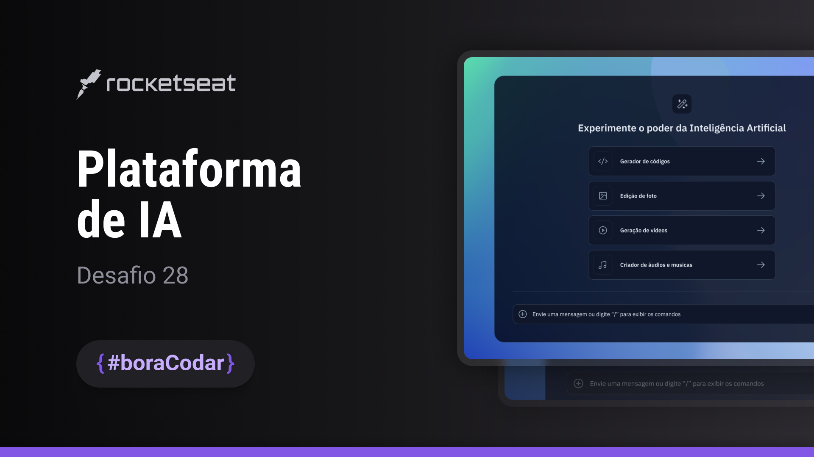

# Plataforma de IA - Desafio 28

## Descrição

O desafio é criar a tela de inicio de uma plataforma de inteligência artificial. No desenvolvimento você pode ir além do proposto, por exemplo, adicionando os efeitos hover nos elementos e criando a versão resposiva do projeto :)
  
Esse desafio foi criado para o #boracodar, um projeto da Rocketseat com desafios semanais para você praticar desenvolvendo como achar melhor e evoluir seu código para o próximo nível.

## Tabela de Conteúdos

- [Tecnologias](#tecnologias)

## 🚀 Tecnologias

Esse projeto foi desenvolvido com as seguintes tecnologias:

- HTML
- CSS
- Git
- GitHub
- Figma

---

Feito com ♥ by Sarah Ribeiro
